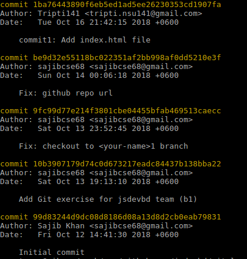

# git-learn
Git practice with jsdevbd (b1) team

## Git Exercise

1. Clone the [git-learn](git@github.com:jsdevbd/git-learn.git) repository.
2. Create a new branch called `<your-name>1` (e.g. sajib1) from `master` branch. Checkout to `<your-name>1` branch.
3. Create a file named `index.html` with following content:
    ```
    <!DOCTYPE html>
    <html>
    <body>

      <h1>My First Commit!</h1>

    </body>
    </html>
    ```
4. Now, Add, Commit with message `commit1: Add index.html file`.
5. See the commit log with `git log` command and take a screenshot & save it with name `commit1.png`.
6. Now, create a directory named `images` and put the **commit1.png** into `images/` directory.
7. Modify index.html following:
    ```
    <!DOCTYPE html>
    <html>
    <body>

      <h1>My First Commit!</h1>

      <!-- add the following two lines -->
      <h2>My Second Commit</h2>
      

    </body>
    </html>
    ```
8. Create a new file named `ignore-the-file.md` & write anything in that file.
9.  Create a new `.gitignore` file with content **ignore-the-file.md** so that git ignores the file.
10. Add, Commit with message `commit2: Add .gitignore file & commit1.png into index.html file`. Push to GitHub (server) `<your-name>1` branch.
11. Now, checkout/move to `master` branch & create and checkout to a new branch called `<your-name>2` (e.g. sajib2).
12. See you have no changes you did in `<your-name>1` branch but you need the changes. So, Pull the changes from remote's `<your-name>1` to local's `<your-name>2` branch. Push the changes to remote's `<your-name>2` branch.
13. Done!
